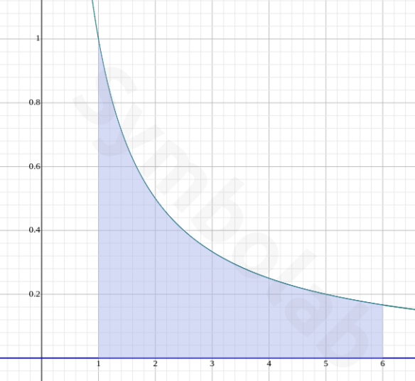
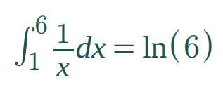

# Parallel Programming Lab (UFF)

This repository contains all the assignments implemented for the
Parallel Programming Lab at the Universidade Federal Fluminense (Master's
Degree).

**Contents**

- [openmpi](#openmpi)
    - [Installation](#installation)
    - [Implementation](#implementation)
- [Coursework](#coursework)
    - [Matrix Multiplication (1st Assignment)](#matrix-multiplication)
    - [Definite Integral (2nd Assignment)](#definite-integral)
- [TODO](#todo)

## openmpi

### Installation

    sudo apt install openmpi-bin openssh-client openssh-server libopenmpi-dev

### Implementation

Check [teste.c](teste.c) for a simple example:

    $ cd uff-lpp
    $ mpicc teste.c -o teste
    $ mpirun -n 4 teste
    a Process 0 on inspiron out of 4
    a Process 1 on inspiron out of 4
    a Process 2 on inspiron out of 4
    a Process 3 on inspiron out of 4

## Coursework

- [Matrix Multiplication (1st Assignment)](#matrix-multiplication)
- [Definite Integral (2nd Assignment)](#definite-integral)

### Matrix Multiplication

Check the [slide](https://gitpitch.com/arthurazs/uff-lpp/master?p=coursework/assignment1).

See the source code [matrix_mpi.c](coursework/assignment1/matrix_mpi.c):

    $ cd uff-lpp/coursework/assignment1
    $ mpicc matrix_mpi.c -o matrix
    $ mpirun -n 4 matrix

    P(2): Multiplying row 2 with column 2
    P(1): Multiplying row 1 with column 1
    P(3): Waiting multiplication results
    P(3): Received message from P(0)
    P(3): Received message from P(1)
    P(0): Multiplying row 0 with column 0
    P(3): Received message from P(2)

    Matrix A [3][2]
    9 0
    5 6
    1 2

    Matrix B [2][3]
    2 4 3
    7 8 9

    Matrix X [3][3]
    18 36 27
    52 68 69
    16 20 21

### Definite Integral

Check the [slide](https://gitpitch.com/arthurazs/uff-lpp/master?p=coursework/assignment2).

Numerical Integration of a Definite Integral using MPI.
Integral (1 to 6) of **1 / x**:

The graph was generated using
[symbolab.com](https://www.symbolab.com/solver/definite-integral-calculator/%5Cint_%7B1%7D%5E%7B6%7D%20%5Cfrac%7B1%7D%7Bx%7D%20dx),
check it out!

Running [integral_mpi.c](coursework/assignment2/integral_mpi.c):

    $ cd uff-lpp/coursework/assignment2
    $ mpicc integral_mpi.c -o integral
    $ mpirun -n 4 integral

    P(3): Estimated 0.233402 for a(4.75) to b(6.00)
    P(0): Estimated 0.812278 for a(1.00) to b(2.25)
    P(2): Estimated 0.305017 for a(3.50) to b(4.75)
    P(1): Estimated 0.441064 for a(2.25) to b(3.50)

    P(0): MPI_Reduce
    Integral (1 to 6) of 1/x

    Expected  result  = 1.79175946923
    Estimated result  = 1.79176079291
                        -------------
    Difference        = 0.00000132368

# TODO

improve matrix calc

# mpi + boost

[download](http://www.boost.org/doc/libs/1_65_1/more/getting_started/unix-variants.html)

extract, then:

    $ cd path/to/boost_1_65_1
    $ ./bootstrap.sh --prefix=/home/username/boost

to run:

    $ mpic++ -o example example.cpp -lboost_mpi -lboost_serialization -std=c++11
    $ mpirun -n 2 example
